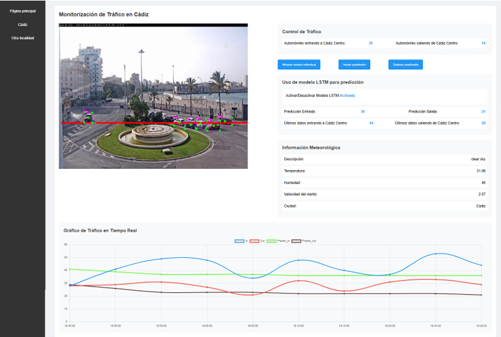

# Real-Time-Traffic-Detection

Este proyecto permite levantar un sistema completo compuesto por una base de datos MySQL y un servidor con una red LSTM para realizar predicciones. El despliegue se realiza mediante Docker y la aplicación web está construida con FastAPI + Uvicorn.

----------------------------------------
REQUISITOS PREVIOS
----------------------------------------
- Tener instalado Docker.
- Tener instalado Python 3.9+.
- Tener configurado un entorno virtual (virtualenv o similar).

----------------------------------------
1. CONTENEDOR DE LA BASE DE DATOS MYSQL
----------------------------------------

1.1 Descargar la imagen de MySQL:
    docker pull mysql:latest

1.2 Levantar el contenedor con configuración:
    docker run --name mydatabase \\
    -e MYSQL_ROOT_PASSWORD=root \\
    -e MYSQL_DATABASE=mydatabase \\
    -p 3306:3306 \\
    -d mysql:latest

Esto creará un contenedor llamado "mydatabase" en el puerto 3306.

----------------------------------------
2. CONTENEDOR DE LA RED LSTM
----------------------------------------

2.1 Construir la imagen desde el Dockerfile (ejecutar en el directorio donde está el Dockerfile):
    docker build -t predictor-lstm .

2.2 Ejecutar el contenedor:
    docker run -d -p 8001:8001 predictor-lstm

Esto levantará el servicio de predicción en el puerto 8001.

----------------------------------------
3. EJECUCIÓN DE LA APLICACIÓN
----------------------------------------

El sistema utiliza un entorno virtual en Python para correr la aplicación web.

3.1 pip install -r requirements.txt

3.2 Ejecutar el archivo principal:
    python main.py

----------------------------------------
4. ACCESO AL SISTEMA
----------------------------------------

Una vez ejecutado, el servidor FastAPI se levanta en el puerto 8000.

En la terminal se mostrará:
- Confirmación de ejecución.
- Los últimos 12 datos almacenados en la base de datos utilizados para predicción.
- La URL de acceso al sistema.

Abrir en el navegador:
    http://localhost:8000

Desde allí podrás acceder a la aplicación web y utilizar sus funcionalidades.

